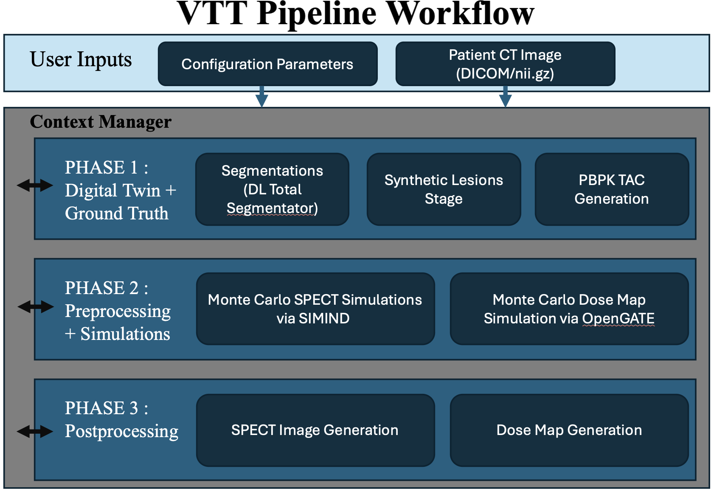

# Virtual Theranostic Trials (VTT) Pipeline

This pipeline creates patient-specific **theranostic digital twins** by combining CT-based anatomy/segmentation with PBPK kinetics and physics-based SPECT simulation/reconstruction, supporting research in diagnosis and therapy planning.

---

## Overview

**Theranostics** is a "diagnose and treat" approach that uses the same biological target to both detect disease and guide targeted therapy.

**Radiopharmaceuticals (RPTs)** couple a targeting molecule with a radionuclide that accumulates in tissues expressing a biomarker (e.g., tumors). As the radionuclide decays, emitted particles can deliver therapy while emitted photons enable quantitative imaging. For example, **¹⁷⁷Lu-PSMA** targets PSMA-expressing prostate cancer and supports post-therapy SPECT imaging.

The **Virtual Theranostic Trial (VTT) Pipeline** is a quantitative software framework that uses real patient CT data to build end-to-end digital twins for theranostics research. It integrates:

- **Patient-specific anatomy** from clinical CT scans
- **Organ/tumor segmentation** (TotalSegmentator-based workflows)
- **Pharmacokinetic (PBPK) modeling** to generate time-activity behavior
- **Monte Carlo SPECT simulation + reconstruction** (SIMIND/PyTomography) to produce quantitative images
- **Monte Carlo dosimetry simulation** (OpenGATE/Geant4) to generate organ-level dose maps

Because uptake and dose can vary substantially between patients, VTTs support evaluation of therapy strategies by enabling controlled, repeatable experiments across anatomy, kinetics, and imaging physics. A key objective is demonstrating agreement with patient measurements to support reliability and validation.



---

## Pipeline Phases

| Phase | Description |
|-------|-------------|
| **Phase 1: Digital Twin & Ground Truth** | CT → TotalSegmentator + ROI unification → (optional) synthetic lesion generation → PBPK TAC generation |
| **Phase 2: Simulations** | SIMIND SPECT simulation (optional, `--spect`) · OpenGATE dosimetry (optional, `--dosimetry`) |
| **Phase 3: Post-Processing** | SPECT post-processing (optional, `--postprocess` + `--spect`) · Dosimetry post-processing (optional, `--postprocess` + `--dosimetry`) |

---

## Installation

### Requirements
- Conda (Miniconda/Anaconda)
- A working C/C++ build toolchain for compiling certain Python dependencies (varies by OS)
- **SIMIND** installed separately (see Step 2)

#### Recommended
- Linux for full pipeline runs
- Sufficient disk for intermediate SIMIND outputs (can be large depending on photons / frames / ROIs)

### 1) Create the conda environment

```bash
conda env create -f environment.yml
conda activate TDT_env
```

> This environment includes all required Python dependencies (TotalSegmentator, PyTomography, OpenGATE, PyCNO, etc.).

### 2) Install SIMIND (external)

**SIMIND is an external dependency** and must be installed separately.

#### Step 1 — Download and install SIMIND
```text
https://www.msf.lu.se/en/research/simind-monte-carlo-program/downloads
```

#### Step 2 — Point the pipeline config to SIMIND
In your JSON config, set:
- `phase_2.simind_stage.SIMINDDirectory` = directory containing the `simind` executable

(Optional sanity check)
```bash
which simind
echo $SMC_DIR
```

---

## Usage

> This repo is run via `main.py` using a user-editable JSON config and CT inputs placed under `inputs/`.
> Install required dependencies and external tools (SIMIND) before running.

### 1) Create your run config

```bash
cp inputs/config_default.json inputs/config.json
```

Then edit `inputs/config.json`.

#### Must update (most users)
- `phase_2.simind_stage.SIMINDDirectory` — path to your SIMIND install.
- `phase_1.segmentation_stage.roi_subset` — list of ROIs to segment.
- `phase_1.segmentation_stage.label_map_path` — path to `tdt_map.json` label map file.
- `phase_1.pbpk_tac_stage.isotope` — isotope for PBPK TAC generation (e.g. `"lu177"`). The TAC is simulated for 10x the isotope half-life.
- `phase_2.simind_stage.roi_subset` — list of ROIs for SIMIND simulation.
- `phase_2.opengate_stage.roi_subset` — list of ROIs for OpenGATE dosimetry.
- `phase_3.spect_postprocess_stage.FrameStartTimes` and `FrameDurations` — frame timing for SPECT reconstruction.

#### Common tweaks (runtime / quality)
- `phase_2.simind_stage.xy_dim` — in-plane resize for SIMIND inputs (smaller = faster).
- `phase_2.simind_stage.NumPhotons`, `NumProjections`, `EnergyWindowWidth` — simulation fidelity vs. runtime.
- `phase_2.simind_stage.NumCores` — CPU cores for parallel SIMIND (`0` = use all available).
- `phase_3.spect_postprocess_stage.Iterations`, `Subsets` — OSEM reconstruction settings.
- `phase_2.opengate_stage.xy_dim` — downsample CT/seg before dosimetry simulation (e.g. `128` for fast validation, `null` for native resolution). Output dose maps are upsampled back to native CT space automatically.
- `phase_2.opengate_stage.gate.total_histories` — Monte Carlo histories for dosimetry.
- `phase_2.opengate_stage.gate.num_threads` — OpenGATE threads (up to your CPU count).

### 2) CT Input

Place your CT data under `inputs/ct_input/`:

```bash
mkdir -p inputs/ct_input
```

You can put **any mix** of the following inside `inputs/ct_input/`:
- A **single NIfTI CT** file (`.nii` or `.nii.gz`)
- One or more **DICOM folders** (each folder containing a CT DICOM series)
- Multiple CTs (multiple NIfTIs and/or multiple DICOM folders)

### 3) Command-line Interface

**Required arguments:**
- `--config_file` : Path to your JSON config file
- `--input_ct_dir` : Directory containing CT inputs

**Optional arguments:**
- `--mode {DEBUG,PRODUCTION}` : Controls verbosity and intermediate file cleanup (default: PRODUCTION)
- `--logging_on / --no-logging_on` : Enable/disable per-CT log file writing (default: enabled)
- `--save_ct_scan / --no-save_ct_scan` : Copy the CT input into the output folder for provenance (default: disabled)
- `--save_config / --no-save_config` : Copy the config JSON into each CT output folder (default: disabled)
- `--synthetic_lesions / --no-synthetic_lesions` : Run synthetic lesion generation (default: disabled; requires `phase_1.synthetic_lesions_stage.specs` to be set in config)
- `--spect / --no-spect` : Run SIMIND SPECT projection simulation (default: disabled)
- `--dosimetry / --no-dosimetry` : Run OpenGATE dosimetry simulation (default: disabled)
- `--postprocess / --no-postprocess` : Run post-processing for whichever simulations ran (default: disabled)

### 4) Run

**Phase 1 only (digital twin + TACs):**
```bash
python -u main.py \
  --config_file inputs/config.json \
  --input_ct_dir inputs/ct_input
```

**Full SPECT pipeline:**
```bash
python -u main.py \
  --config_file inputs/config.json \
  --input_ct_dir inputs/ct_input \
  --spect --postprocess
```

**Full dosimetry pipeline:**
```bash
python -u main.py \
  --config_file inputs/config.json \
  --input_ct_dir inputs/ct_input \
  --dosimetry --postprocess
```

**Run everything:**
```bash
python -u main.py \
  --config_file inputs/config.json \
  --input_ct_dir inputs/ct_input \
  --mode DEBUG \
  --logging_on \
  --save_config \
  --synthetic_lesions \
  --spect --dosimetry --postprocess
```

---

## Outputs

Each CT input generates an output folder under `<output_folder_title>_CT_<index>/` with subfolders per phase.

### Example Structure

```
tdt_test_run_CT_0/
  digital_twin/                              <- Phase 1
    ct.nii.gz                                <- standardized CT handoff
    digital_twin.nii.gz                      <- unified TDT multilabel segmentation handoff
    segmentation_stage/
    synthetic_lesions_stage/                  <- (if synthetic lesions enabled)
    pbpk_tac_stage/
      pbpk_tacs.json                         <- human-readable TAC metadata
      pbpk_tacs.npz                          <- full-resolution TAC arrays
  simulations/                               <- Phase 2
    simind_simulation/
      preprocess/                            <- SIMIND preprocessing outputs
      headers/                               <- SIMIND headers (survives PRODUCTION cleanup)
      work_dir/                              <- per-core SIMIND outputs
    <prefix>_tot_w1/w2/w3.a00                <- summed projection totals (all ROIs)
    calib.res                                <- SIMIND calibration (sensitivity)
    opengate_simulation/                     <- (if --dosimetry)
      work_dir/
        source_masks/
        resampled_inputs/
        <prefix>_dose_<roi>.nii.gz           <- per-ROI dose maps (Gy/decay)
      <prefix>_dose_sum.nii.gz               <- summed dose map (Gy/decay)
  post_processing/                           <- Phase 3
    spect_postprocess/                       <- (if --spect --postprocess)
      <prefix>_<t_hr>_tot_w1/w2/w3.nii.gz   <- PBPK-weighted projections per frame
    reconstructed_SPECT_<t_hr>.nii.gz        <- reconstructed SPECT image per frame
    dosemap_postprocess/                     <- (if --dosimetry --postprocess)
      work_dir/                              <- metadata
    <prefix>_total_dose.nii.gz               <- total absorbed dose map (Gy)
  logging_file_CT_0.log                      <- per-CT pipeline log
```

**Notes:**
- `*_tot_w1/w2/w3.a00` are SIMIND energy-window projection totals (lower / photopeak / upper).
- `calib.res` is produced by SIMIND Jaszczak calibration and converts counts -> activity.
- All dose maps in the dosimetry output are in native CT resolution (upsampled back if `xy_dim` was set).
- The total dose map is computed using per-ROI weighting: each ROI's dose-per-decay map is multiplied by that ROI's own cumulated activity (TAC integrated from t=0 over 10x the isotope half-life, capturing >99.9% of all decays), then summed across ROIs. This avoids unphysical cross-terms.
- PBPK TAC simulation length is derived automatically from the configured isotope half-life (10x multiplier). If any SPECT frame time extends beyond this, the TAC is extended to cover it.
- In `PRODUCTION` mode, SIMIND `work_dir` is deleted after post-processing to save disk space.
- SIMIND header files are preserved in `headers/` to support reconstruction.
- PBPK TACs are saved as JSON + npz in Phase 1 and reused by both SPECT and dosimetry post-processing.

---

## Stage Files

```
src/stages/
  segmentation_stage.py         <- TotalSegmentator + ROI unification (merged)
  synthetic_lesions_stage.py    <- Optional synthetic lesion generation
  pbpk_tac_stage.py             <- PBPK TAC generation (isotope-aware stop time)
  simind_simulation_stage.py    <- SIMIND preprocessing + Monte Carlo simulation (merged)
  opengate_simulation_stage.py  <- OpenGATE voxel-source dosimetry
  spect_postprocess_stage.py    <- TAC weighting + Poisson noise + OSEM reconstruction
  dosemap_postprocess_stage.py  <- Per-ROI TAC-weighted total absorbed dose map
```

---

## Contact

Maintainer: Peter Yazdi
Email: pyazdi@bccrc.ca
